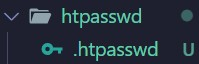

# Guía de configuración de Nginx

## Estructura de archivos

1. **Carpeta `conf`:**  
   - Creamos una carpeta `conf` y copiamos los archivos de configuración predeterminados en ella.

   

2. **Carpetas `sites-available`:**  
   - Creamos la carpeta `sites-available`, donde copiamos el archivo `default.conf` y creamos los archivos de configuración para cada webhost que vayamos a generar.

   

3. **Carpeta `websites`:**  
   - Dentro de la carpeta `websites`, creamos subcarpetas para cada webhost.

   

4. **HTML de sitios web:**  
   - Dentro de `websites`, creamos un archivo HTML para el sitio web por defecto y un archivo HTML para cada webhost en sus respectivas carpetas.

  

5. **Carpeta `privado`:**  
   - Para el webhost con SSL, creamos una carpeta `privado` a la cual se accederá solo después de iniciar sesión. También creamos un archivo `.htaccess` dentro de esta carpeta.

   

6. **Script de automatización:**  
   - Creamos un archivo `script` que ejecuta automáticamente los comandos para habilitar los sitios, activar el módulo SSL y reiniciar el servicio de Nginx.

  

8. **Carpetas adicionales:**  
   - Creamos la carpeta `htpasswd` (donde posteriormente añadiremos el archivo de autenticación) y la carpeta `certs` (donde más tarde añadiremos los certificados SSL).

   
   

9. **Archivo `docker-compose.yml`:**  
   - Creamos el archivo `docker-compose.yml` con la configuración necesaria para el contenedor de Apache.

   

## Generación de Certificados SSL

Para generar certificados SSL, instalamos **OpenSSL** y ejecutamos el siguiente comando (sustituyendo `seguro` por el nombre del webhost):

```bash
openssl req -x509 -nodes -days 365 -newkey rsa:2048 -keyout seguro.key -out seguro.crt
```

Al ejecutar el comando, te pedirá una serie de datos; en el campo **Common Name**, ingresa el nombre del webhost (por ejemplo, `seguro.net`).

Una vez generados, copia los archivos a la carpeta `certs`.


## Modificación del Archivo Hosts
Modifica el archivo `hosts` de tu sistema (ubicado en `C:\Windows\System32\drivers\etc`) para añadir las IPs y nombres de los webhosts creados.


## Despliegue del Contenedor
Ejecuta el siguiente comando para construir y levantar el contenedor:

```bash
docker-compose –build -d
```
Si tenemos algún error podemos borrar lo generado con el comando:

```bash
docker-compose down
```

Para acceder a la terminal del servidor generado usamos el comando:

```bash
docker exec -it apache_server /bin/bash
```

(También sirve `bash`)


## Generación del archivo .htpasswd

A continuacion tendremos que generar el archivo `.htpasswd` con su usuario y contraseña.

Después de acceder a la terminal de Apache, dirigimos nuestra atención a la ruta `/etc/apache2`.

Ejecutando el comando `ls -a`, podremos visualizar los archivos ocultos y confirmar la existencia del archivo `.htpasswd`. Si no está presente, procederemos a crearlo; si ya existe, lo reemplazaremos.

Para crear o modificar el archivo, utilizaremos el siguiente comando:

```bash
htpasswd -c /etc/apache2/.htpasswd usuario
```

En `usuario`, ingresaremos el nombre de usuario que deseamos utilizar, y se nos solicitará que introduzcamos la contraseña cuando sea necesario.


El archivo se ubicará automáticamente en la ruta de nuestro proyecto gracias a la creación del volumen en el archivo `docker-compose.yml`.

## Pruebas en el Navegador

A continuación, abrimos el navegador y probamos las siguientes URLs:

- `http://alba.com:8086`


- `http://garcia.com:8086`


- `https://seguro.net:8444`

- `https://seguro.net/privado` ➡️ **Aquí introducimos los credenciales generados con htpasswd**


Si ingresamos las credenciales correctas nos saldrá la siguiente página


Si metemos mal las credenciales nos aparecera lo siguiente 


